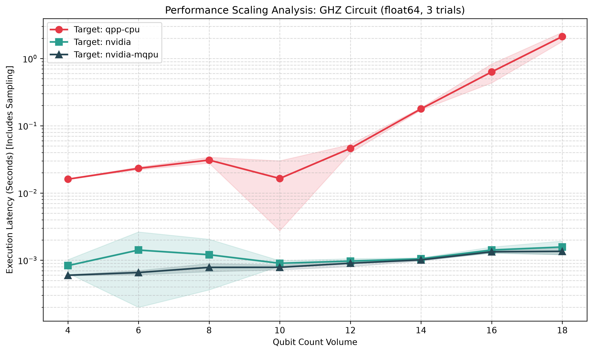
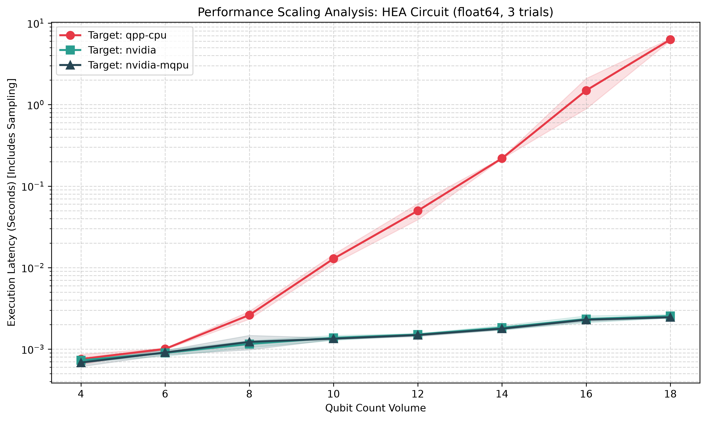

# Heterogeneous Quantum Emulation Performance Benchmark


A comparative performance analysis evaluating execution latency scaling across classical CPU execution architectures versus hardware-accelerated GPU pipelines using the **NVIDIA CUDA-Q** framework.

## Project Overview
This project benchmarks the performance characteristics of simulating multi-qubit states under varying hardware backends. 

**Note:** This project performs *Quantum Emulation* on classical hardware (NVIDIA GPU/x86 CPU). It does not execute on a physical QPU.

As quantum state spaces scale exponentially O(N^2), traditional single-node CPU architectures face a steep computational wall. This suite models that breakdown and demonstrates how GPU-parallelized engines mitigate the scaling bottleneck. The repository is built with a modular, production-ready architecture featuring automated data logging, separated visualization pipelines, and containerized deployment.

```text
cudaq-performance-benchmarking/
├── benchmarks/
│   ├── hybrid_scaling_test.py   # Core CLI execution and JSON data logging
│   └── plot_results.py          # Decoupled visualization generation
├── dashboard/
│   └── app.py                   # Interactive Streamlit web dashboard
├── data/
│   └── benchmark_results_*.json # Structured output from simulation runs
├── reports/
│   └── benchmark_chart_*.png    # Generated log-scale performance artifacts
├── tests/
│   └── test_benchmark.py        # Unit tests (CPU-only, no GPU required)
├── .github/
│   └── workflows/ci.yml         # GitHub Actions CI pipeline
├── Dockerfile                   # Environment provisioning (NVIDIA base image)
├── config.yaml                  # Configuration file for benchmarking tests
├── requirements.txt             # Python dependency specification
├── LICENSE
└── README.md
```

## Architectural Metrics & Analysis
The benchmarking suite evaluates state-vector tracking from 4 to 18 qubits using 500 execution shots per scale sequence. Each qubit count is benchmarked over **multiple independent trials** (configurable via `num_trials`, default: 3), recording the mean, standard deviation, and minimum latency for statistical rigor. To ensure scientific accuracy, a JIT-compilation "warm-up" circuit is executed for *every* specific qubit size prior to its measuring loop. This prevents dynamic AST compilation and driver overheads from skewing the true algorithmic latency metrics.

### Benchmarked Circuits
The suite now dynamically tests multiple circuit architectures to evaluate workload diversity:
1. **GHZ State:** A highly entangled sequence acting as a baseline metric.
2. **Hardware Efficient Ansatz (HEA):** A parameterized circuit heavily used in Variational Quantum Eigensolvers (VQE) and QAOA, consisting of dense single-qubit rotations (`RX`, `RZ`) followed by entangling `CX` layers.

### Measurement Overhead vs State Vector Evolution
In a state-vector simulator, calling a sampling function (like `cudaq.sample`) performs two expensive tasks: 
1. **State Vector Evolution:** Multiplying the state vector by the quantum gates.
2. **Measurement Overhead:** Collapsing the computed wavefunction into a probability distribution and drawing samples from it.

By default, this suite benchmarks the full sampling pipeline. If your goal is strictly benchmarking the computational limit of simulating gates, you can use the `--evolution-only` flag to isolate the raw matrix multiplication speed using `cudaq.get_state()`. Note: This flag is incompatible with noise modeling.

### Noise Modeling
You can introduce a Depolarizing Channel to simulate the decoherence inherent in NISQ devices. Setting `noise_probability: 0.01` (or any positive value) in the `config.yaml` applies depolarization noise to **every gate on every qubit** in the circuit — all single-qubit gates (`RX`, `RZ`, `H`) across all indices and all two-qubit `CX` gates across all adjacent pairs. Noise simulation forces density matrix tracking or stochastic sampling, vastly increasing the computational complexity.

### Interactive Streamlit Dashboard
Instead of generating static PNG charts, this suite now features a fully interactive web dashboard built with **Streamlit**. You can dynamically filter targets, select quantum circuits, and visualize performance bottlenecks right in your browser. The dashboard automatically handles both legacy single-value data and the newer multi-trial statistical format.

### Performance Artifacts (Static)
While the web dashboard provides the best experience, the static charts generated from the baseline precision are included below:

**GHZ Circuit Scaling**


**HEA Circuit Scaling**


### Precision Scaling (`float32` vs `float64`)
By default, CUDA-Q and the benchmark suite execute with **Double Precision (`float64`)**. You can configure the suite to evaluate **Single Precision (`float32`)** by changing the `precision` key in `config.yaml`. Single precision cuts the memory bandwidth and footprint in half, which drastically alters the GPU scaling curve and delays the VRAM saturation point for extremely large qubit counts.

Output filenames are automatically suffixed with the precision (e.g., `benchmark_results_float64.json`) to prevent data from being overwritten when running multiple precision configurations.

### Key Observations
1. **The Initialization Tax Eliminated:** Previously, the GPU exhibited severe latency at low qubit volumes due to driver and kernel JIT compilation overhead. By executing a JIT warm-up circuit inside the benchmark loop, this initialization tax is entirely decoupled. Consequently, the GPU matches or slightly outperforms the CPU even at minimal qubit volumes (N=4).
2. **The True Efficiency Crossover:** Because PCIe bus transfer and kernel launch overheads remain essentially constant (approx. ~1ms), the GPU pipeline operates highly efficiently across all tested volumes. The true computational divergence occurs around 12 qubits, where the CPU's cache can no longer contain the state vector.
3. **Exponential Classical Degradation:** Beyond 12 qubits, the CPU execution latency scales exponentially due to the $O(2^N)$ growth of the underlying complex state vectors.
4. **Massive Parallel Throughput:** The NVIDIA GPU pipeline maintains a near-flat execution latency up to 18 qubits, leveraging dense Streaming Multiprocessor (SM) arrays to compute matrix transformations simultaneously without hitting VRAM bottlenecks.

## Technical Toolchain
* **Framework:** NVIDIA CUDA-Q
* **Hardware Acceleration Engine:** NVIDIA T4 GPU (via cuStateVec)
* **Classical Simulation Target:** qpp-cpu (OpenMP-accelerated host simulator)
* **Distributed Target:** nvidia-mqpu (MPI-based Multi-GPU orchestration)
* **Data Pipeline:** JSON Structured Logging / Matplotlib
* **CI/CD:** GitHub Actions (lint, test, Docker build)

---

## Configuration Reference

All parameters can be set in `config.yaml` and overridden via CLI flags:

| Parameter | Config Key | CLI Flag | Default | Description |
|---|---|---|---|---|
| Min Qubits | `min_qubits` | `--min-qubits` | 4 | Starting qubit count |
| Max Qubits | `max_qubits` | `--max-qubits` | 16 | Ending qubit count |
| Step | `step` | `--step` | 2 | Qubit count increment |
| Shots | `shots` | `--shots` | 500 | Measurement shots per trial |
| Trials | `num_trials` | `--num-trials` | 3 | Independent trials per qubit count |
| Precision | `precision` | `--precision` | float64 | Simulation precision (float32/float64) |
| Evolution Only | `evolution_only` | `--evolution-only` | false | Benchmark state vector evolution only |
| Noise Probability | `noise_probability` | — | 0.0 | Depolarizing channel probability |
| Targets | `targets` | — | [qpp-cpu, nvidia] | Simulation backends to benchmark |
| Circuits | `circuits` | — | [ghz] | Circuit architectures to test |

---

## How to Run

### Option 1: Containerized Deployment (Recommended)
Avoid local dependency conflicts by running the suite via Docker. Ensure your host system has the NVIDIA Container Toolkit installed. The container securely uses a non-root user, maps permissions automatically, and pre-installs OpenMPI for multi-GPU scaling.

```bash
# 1. Build the image
docker build -t cudaq-bench .

# 2. Run the benchmarking suite standard
docker run --gpus all -v $(pwd)/data:/app/data -v $(pwd)/reports:/app/reports cudaq-bench

# 3. Distributed Scaling (Multi-GPU via MPI)
docker run --gpus all -v $(pwd)/data:/app/data -v $(pwd)/reports:/app/reports cudaq-bench mpirun -np 2 python3 benchmarks/hybrid_scaling_test.py

# 4. Launch the Interactive Web Dashboard
docker run -p 8501:8501 -v $(pwd)/data:/app/data cudaq-bench streamlit run dashboard/app.py
```

### Option 2: Local Python Environment
If running natively, provision an environment with access to an active NVIDIA GPU runtime and OpenMPI.

```bash
# 1. Install dependencies
pip install -r requirements.txt

# 2. Execute the core benchmarking pipeline using config.yaml defaults
python benchmarks/hybrid_scaling_test.py 

# 3. (Optional) Run with MPI for Multi-GPU distribution
mpirun -np 2 python benchmarks/hybrid_scaling_test.py

# 4. Generate the performance graph
python benchmarks/plot_results.py

# 5. Run the unit tests
pytest tests/ -v
```

## License
Distributed under the MIT License. See LICENSE for more information.
