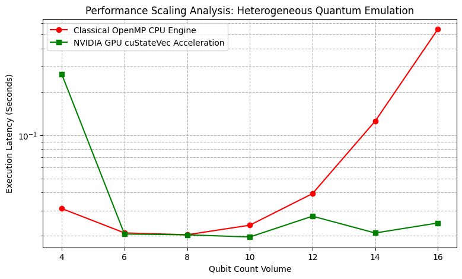

# Heterogeneous Quantum Emulation Performance Benchmark

A comparative performance analysis evaluating execution latency scaling across classical CPU execution architectures versus hardware-accelerated GPU pipelines using the **NVIDIA CUDA-Q** framework.

## Project Overview
This project benchmarks the performance characteristics of simulating multi-qubit entangled states (GHZ states) under varying hardware backends. As quantum state spaces scale exponentially ($2^N$), traditional single-node CPU architectures face a steep computational wall. This suite models that breakdown and demonstrates how GPU-parallelized engines mitigate the scaling bottleneck.

## Architectural Metrics & Analysis
The benchmarking suite evaluates state-vector tracking from 4 to 16 qubits using 500 execution shots per scale sequence.

### Performance Artifact


### Key Observations
1. **Initialization Overhead:** At a low qubit volume ($N=4$), the classical CPU engine outperforms the GPU pipeline. This highlights the memory allocation, kernel compilation, and PCIe bus transfer overhead native to heterogeneous computing.
2. **The Efficiency Crossover:** Between 6 and 8 qubits, the computational density amortizes the initialization latency, making GPU acceleration highly efficient.
3. **Exponential Classical Degradation:** Beyond 10 qubits, the CPU execution latency scales vertically due to the exponential growth of the underlying complex state vectors.
4. **Massive Parallel Throughput:** The NVIDIA GPU pipeline maintains near-flat execution latency up to 16 qubits, leveraging dense thread arrays to compute matrix transformations simultaneously.

## Technical Toolchain
* **Framework:** NVIDIA CUDA-Q
* **Hardware Acceleration Engine:** NVIDIA T4 GPU (via cuStateVec)
* **Classical Simulation Target:** `qpp-cpu` (OpenMP-accelerated host simulator)
* **Language:** Python 3.10+ / Matplotlib

## How to Run
1. Provision an environment with access to an active NVIDIA GPU runtime.
2. Install the necessary pre-compiled binary modules:
   ```bash
   pip install cudaq matplotlib
   ```
3. Execute the core benchmarking pipeline:
   ```bash
   python benchmarks/hybrid_scaling_test.py
   ```
