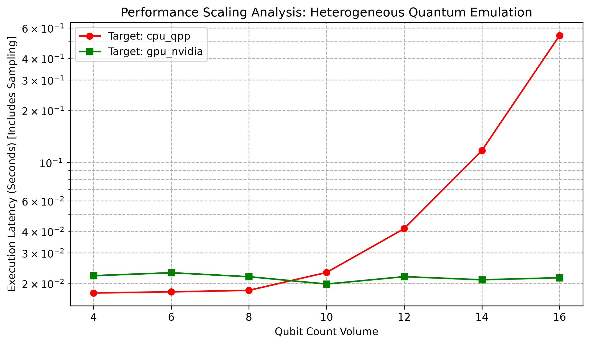

# Heterogeneous Quantum Emulation Performance Benchmark


A comparative performance analysis evaluating execution latency scaling across classical CPU execution architectures versus hardware-accelerated GPU pipelines using the **NVIDIA CUDA-Q** framework.

## Project Overview
This project benchmarks the performance characteristics of simulating multi-qubit states under varying hardware backends. 

**Note:** This project performs *Quantum Emulation* on classical hardware (NVIDIA GPU/x86 CPU). It does not execute on a physical QPU.

As quantum state spaces scale exponentially O(N^2), traditional single-node CPU architectures face a steep computational wall. This suite models that breakdown and demonstrates how GPU-parallelized engines mitigate the scaling bottleneck. The repository is built with a modular, production-ready architecture featuring automated data logging, separated visualization pipelines, and containerized deployment.

```text
cudaq-performance-benchmarking/
├── benchmarks/
│   ├── hybrid_scaling_test.py   # Core CLI execution and JSON data logging
│   └── plot_results.py          # Decoupled visualization generation
├── data/
│   └── benchmark_results.json   # Structured output from simulation runs
├── reports/
│   └── benchmark_chart.png      # Generated log-scale performance artifact
├── Dockerfile                   # Environment provisioning (NVIDIA base image)
├── config.yaml                  # Configuration file for benchmarking tests
├── LICENSE
└── README.md
```

## Architectural Metrics & Analysis
The benchmarking suite evaluates state-vector tracking from 4 to 18 qubits using 500 execution shots per scale sequence. To ensure scientific rigor, a JIT-compilation "warm-up" circuit is executed prior to the benchmarking loop to prevent driver initialization overhead from skewing latency metrics.

### Benchmarked Circuits
The suite now dynamically tests multiple circuit architectures to evaluate workload diversity:
1. **GHZ State:** A highly entangled sequence acting as a baseline metric.
2. **Hardware Efficient Ansatz (HEA):** A parameterized circuit heavily used in Variational Quantum Eigensolvers (VQE) and QAOA, consisting of dense single-qubit rotations (`RX`, `RZ`) followed by entangling `CX` layers.

### Measurement Overhead vs State Vector Evolution
In a state-vector simulator, calling a sampling function (like `cudaq.sample`) performs two expensive tasks: 
1. **State Vector Evolution:** Multiplying the state vector by the quantum gates.
2. **Measurement Overhead:** Collapsing the computed wavefunction into a probability distribution and drawing samples from it.

By default, this suite benchmarks the full sampling pipeline. If your goal is strictly benchmarking the computational limit of simulating gates, you can use the `--evolution-only` flag to isolate the raw matrix multiplication speed using `cudaq.get_state()`. Note: This flag is incompatible with noise modeling.

### Noise Modeling
You can introduce a Depolarizing Channel to simulate the decoherence inherent in NISQ devices. Setting `noise_probability: 0.01` (or any positive value) in the `config.yaml` applies noise across all gates. Noise simulation forces density matrix tracking or stochastic sampling, vastly increasing the computational complexity.

### Performance Artifact


### Key Observations
1. **The Initialization Tax:** At a low qubit volume (N=4), the classical CPU engine outperforms the GPU pipeline. This highlights the memory allocation, kernel JIT compilation, and PCIe bus transfer overhead native to heterogeneous computing.
2. **The Efficiency Crossover:** Between 8 and 10 qubits, the computational density amortizes the initialization latency, making GPU acceleration highly efficient.
3. **Exponential Classical Degradation:** Beyond 12 qubits, the CPU execution latency scales vertically due to the exponential growth of the underlying complex state vectors.
4. **Massive Parallel Throughput:** The NVIDIA GPU pipeline maintains near-flat execution latency up to 18 qubits, leveraging dense thread arrays to compute matrix transformations simultaneously without hitting VRAM bottlenecks.

## Technical Toolchain
* **Framework:** NVIDIA CUDA-Q
* **Hardware Acceleration Engine:** NVIDIA T4 GPU (via cuStateVec)
* **Classical Simulation Target:** qpp-cpu (OpenMP-accelerated host simulator)
* **Distributed Target:** nvidia-mqpu (MPI-based Multi-GPU orchestration)
* **Data Pipeline:** JSON Structured Logging / Matplotlib

---

## How to Run

### Option 1: Containerized Deployment (Recommended)
Avoid local dependency conflicts by running the suite via Docker. Ensure your host system has the NVIDIA Container Toolkit installed. The container securely uses a non-root user, maps permissions automatically, and pre-installs OpenMPI for multi-GPU scaling.

```bash
# 1. Build the image
docker build -t cudaq-bench .

# 2. Run the benchmarking suite standard
docker run --gpus all -v $(pwd)/data:/app/data -v $(pwd)/reports:/app/reports cudaq-bench

# 3. Distributed Scaling (Multi-GPU via MPI)
docker run --gpus all -v $(pwd)/data:/app/data -v $(pwd)/reports:/app/reports cudaq-bench mpirun -np 2 python3 benchmarks/hybrid_scaling_test.py

# 4. Generate the visualization locally
python benchmarks/plot_results.py
```

### Option 2: Local Python Environment
If running natively, provision an environment with access to an active NVIDIA GPU runtime and OpenMPI.

```bash
# 1. Install dependencies
pip install cudaq matplotlib pyyaml

# 2. Execute the core benchmarking pipeline using config.yaml defaults
python benchmarks/hybrid_scaling_test.py 

# 3. (Optional) Run with MPI for Multi-GPU distribution
mpirun -np 2 python benchmarks/hybrid_scaling_test.py

# 4. Generate the performance graph
python benchmarks/plot_results.py
```

## License
Distributed under the MIT License. See LICENSE for more information.
